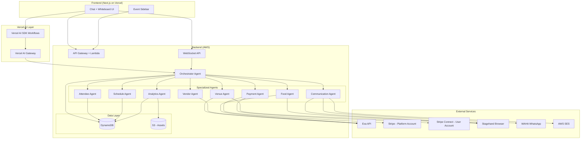
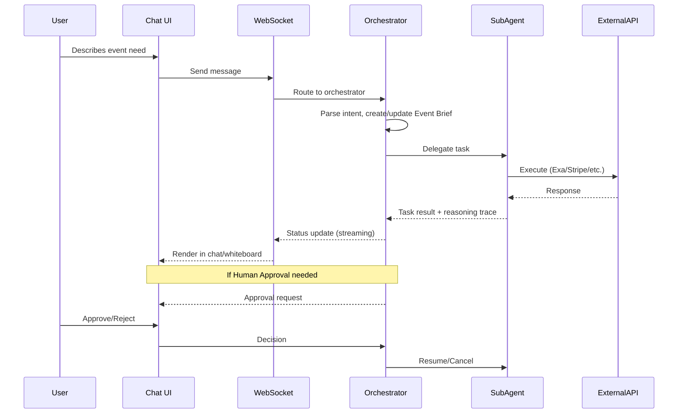

# Design Document: AI Event Organizer

## Overview

The AI Event Organizer is a multi-agent system that automates end-to-end event planning through a conversational interface. Instead of a traditional dashboard, the system presents two modes: a **Chat Mode** (ChatGPT-like conversational interface) and a **Whiteboard Mode** (visual overview of the event lifecycle). An orchestrator agent coordinates specialized sub-agents for venue sourcing, vendor negotiation, payments, communications, scheduling, attendee management, and analytics — all with human-in-the-loop approval for high-stakes actions.

The system targets Singapore-based events and integrates with Exa (web search), Stripe MCP (payments), Stagehand (browser automation), WAHA (WhatsApp), and AWS SES (email). It operates on a pay-per-usage credits model.

### Open-Source Best Practices (2026)

| Project | How We Use It | Pitch Value |
|---------|--------------|-------------|
| **Headroom** (chopratejas/headroom) | Context compression layer — compresses agent tool outputs, logs, and RAG fragments by 50-90% before passing to LLM. Reduces token costs and keeps long-running event planning sessions within context limits | "Production-grade context optimization used at Netflix scale" |
| **Supermemory architecture** (supermemoryai/supermemory) | Memory pattern inspiration — user profiles, memory graphs for event relationships, sub-300ms retrieval. Store event preferences, vendor history, past decisions across sessions | "State-of-the-art agent memory with temporal reasoning" |
| **Stagehand** (browserbase/stagehand) | Browser automation — FoodPanda ordering, venue website navigation, form filling. No API needed for any web service | "Agentic browser control for real-world actions" |
| **WAHA** (devlikeapro/waha) | Self-hosted WhatsApp Business API — vendor/attendee communication without third-party SaaS dependency | "Open-source WhatsApp integration with full message control" |
| **React Flow** (xyflow/xyflow) | Whiteboard canvas — pan/zoom/interactive nodes for event visualization | "Production-grade node-based canvas (used by Stripe, Datadog)" |

### Key Design Decisions

| Decision | Choice | Rationale |
|----------|--------|-----------|
| UI Paradigm | Chat + Whiteboard (no dashboard) | Minimizes cognitive load; user interacts conversationally, visualizes via whiteboard |
| Agent Orchestration | Vercel AI SDK Workflows | Production-grade multi-step agent orchestration with streaming, state persistence, and tool-calling; required for Top 5 |
| LLM Routing | Vercel AI Gateway | Observability, caching, rate limiting, model fallback for all LLM calls; required for Top 5 |
| Context Management | Headroom compression layer | Compresses tool outputs/logs 50-90%, keeps long event sessions within context window |
| Agent Memory | Supermemory-inspired architecture (DynamoDB + embeddings) | User profiles, event preferences, vendor history persisted across sessions with sub-300ms retrieval |
| Agent Architecture | Orchestrator + 8 specialized agents | Separation of concerns; each agent has focused tooling and context |
| Payment Processing | Stripe MCP (dual-account model) | Platform account for checkout/credits, user's connected account (Stripe Connect) for ticket revenue; Best Use of Stripe |
| Web Research | Exa API | Semantic search for venues/vendors, hackathon prize alignment (Best Use of Exa) |
| Browser Automation | Stagehand (open-source) | Enables FoodPanda ordering, venue website navigation without APIs |
| WhatsApp Integration | WAHA (open-source) | Self-hosted WhatsApp Business API, no vendor lock-in |
| Email | AWS SES | Cost-effective, scalable, already within AWS ecosystem |
| Infrastructure | AWS (serverless where possible) | Scalability, cost efficiency for hackathon demo |
| Frontend Deployment | Vercel | Next.js native hosting, edge functions, seamless AI SDK integration |

---

## Architecture

### High-Level Architecture



### Communication Flow



### Deployment Architecture

- **Frontend**: Next.js deployed on Vercel with AI SDK integration
- **AI Orchestration**: Vercel AI SDK Workflows for multi-agent coordination with streaming
- **LLM Routing**: Vercel AI Gateway for all model calls (observability, caching, fallback)
- **API Layer**: AWS API Gateway (REST + WebSocket)
- **Compute**: AWS Lambda (agent logic), AWS Step Functions (long-running workflows)
- **Database**: DynamoDB (event data, agent state, conversations, credits, audit logs)
- **Storage**: S3 (generated assets, reports, event pages)
- **Browser Automation**: Stagehand running on AWS ECS/Fargate containers
- **Message Queue**: SQS for async agent task distribution
- **Real-time**: WebSocket API Gateway for streaming reasoning traces and status updates
- **Payments**: Stripe (sandbox) — platform account for checkout/credits, Stripe Connect for user ticket revenue

---

## Frontend Technology Stack

| Library | Purpose | Why |
|---------|---------|-----|
| **Next.js 14** (App Router) | Framework | Vercel-native, server components, API routes, streaming support |
| **Tailwind CSS** + **shadcn/ui** | UI Components | Polished, accessible, themeable, fast to build with |
| **Framer Motion** | Animations | Smooth transitions between chat/whiteboard modes, micro-interactions |
| **React Flow** | Whiteboard canvas | Pan, zoom, drag nodes, custom node types, minimap, handles connections — purpose-built for exactly this use case |
| **Vercel AI SDK** (`ai` package) | LLM streaming | `useChat` hook for streaming responses, tool-calling UI |
| **Zustand** | State management | Lightweight, minimal boilerplate for event/agent state |
| **Lucide React** | Icons | Consistent, clean icon set matching shadcn |
| **Sonner** | Toast notifications | Elegant notifications for approvals, status changes |
| **react-dropzone** | File uploads | Drag-and-drop file attachments in chat |
| **qrcode.react** | QR code generation | For check-in tickets |
| **recharts** | Charts/analytics | For post-event reports and budget visualizations |
| **next-auth** | Authentication | User accounts, session management |

### Design Principles
- **Light theme** — clean, professional, non-intimidating for non-technical users
- **Chat input always visible** — in both chat mode and whiteboard mode (fixed bottom bar)
- **Whiteboard is read-only** — users view/inspect but make changes via chat (reduces complexity)
- **Status colors**: Green = done, Yellow = in-progress/awaiting, Red = failed/urgent, Blue = info/pending approval
- **Expandable cards** — click to see details, right-click for context menu (view history, copy link)

---

## Components and Interfaces

### 1. Frontend Components

#### 1.1 Event Sidebar (Left Panel)
```typescript
interface EventSidebarProps {
  events: EventSummary[];
  activeEventId: string | null;
  onSelectEvent: (eventId: string) => void;
  onCreateEvent: () => void;
}

interface EventSummary {
  id: string;
  name: string;
  date: string;
  status: 'planning' | 'confirmed' | 'in-progress' | 'completed';
  lastActivity: string;
}
```

#### 1.2 Chat Mode (Right Panel - Default)
```typescript
interface ChatMessage {
  id: string;
  role: 'user' | 'assistant' | 'system';
  content: string;
  timestamp: string;
  attachments?: FileAttachment[]; // User-uploaded files (images, PDFs, documents)
  metadata?: {
    agentName?: string;
    reasoningTrace?: ReasoningStep[];
    approvalRequest?: ApprovalRequest;
    statusUpdate?: AgentStatusUpdate;
    comparisonTable?: ComparisonData;
    creditsCost?: number; // Credits consumed by this operation
  };
}

interface FileAttachment {
  id: string;
  name: string;
  type: string; // MIME type
  url: string; // S3 pre-signed URL
  size: number;
}

interface ApprovalRequest {
  id: string;
  actionType: 'payment' | 'communication' | 'booking' | 'checkout';
  amount?: number;
  currency?: string;
  recipient?: string;
  description: string;
  consequenceApprove: string;
  consequenceReject: string;
  status: 'pending' | 'approved' | 'rejected';
}
```

#### 1.3 Whiteboard Mode (Toggle from Chat — powered by React Flow)
```typescript
import { Node, Edge, Viewport } from 'reactflow';

interface WhiteboardState {
  eventId: string;
  nodes: WhiteboardNode[];
  edges: WhiteboardEdge[];
  viewport: Viewport; // { x, y, zoom } — user can pan/zoom freely
}

interface WhiteboardNode extends Node {
  id: string;
  type: 'schedule-block' | 'vendor-card' | 'venue-card' | 'payment-status' 
    | 'attendee-stats' | 'task-card' | 'communication-log' | 'analytics-widget';
  position: { x: number; y: number };
  data: {
    title: string;
    status: 'pending' | 'in-progress' | 'completed' | 'failed' | 'awaiting-approval';
    statusColor: 'green' | 'yellow' | 'red' | 'blue';
    statusIcon: string; // Lucide icon name
    summary: string; // One-line description shown on card
    details: Record<string, unknown>; // Shown on expand/click
    links?: { label: string; url: string }[]; // Clickable links (registration forms, venues, etc.)
    expandable: boolean; // Click to show full discussion/search history
    discussionHistory?: DiscussionEntry[]; // Shown in expand panel
    lastUpdated: string;
  };
}

interface WhiteboardEdge extends Edge {
  from: string;
  to: string;
  label?: string;
  animated?: boolean; // Animated = in-progress
}

interface DiscussionEntry {
  timestamp: string;
  agent: string;
  action: string;
  outcome: string;
}

// Whiteboard is READ-ONLY — changes happen via chat input
// Status icons: click to show popup with details
// Cards: click to expand, shows history/context
// No drag-to-edit — just drag to pan, scroll to zoom
```

### 2. Backend - Orchestrator Agent (via Vercel AI SDK Workflows)

```typescript
import { createWorkflow, createStep } from '@vercel/ai-sdk/workflows';
import { gateway } from '@/lib/ai-gateway';

// All LLM calls routed through Vercel AI Gateway
// Gateway configured with: primary model, fallback, caching, rate limiting
// See lib/ai-gateway.ts for configuration

interface OrchestratorAgent {
  parseIntent(message: string, context: ConversationContext): Promise<Intent>;
  createEventBrief(description: string): Promise<EventBrief>;
  delegateTask(task: AgentTask): Promise<TaskResult>;
  handleApproval(approvalId: string, decision: 'approve' | 'reject'): Promise<void>;
  getReasoningTrace(taskId: string): Promise<ReasoningStep[]>;
}

interface Intent {
  type: 'create_event' | 'search_venue' | 'find_vendor' | 'make_payment' 
    | 'send_message' | 'manage_schedule' | 'check_status' | 'modify_event'
    | 'order_food' | 'manage_attendees' | 'generate_content' | 'get_analytics'
    | 'purchase_credits' | 'connect_stripe';
  parameters: Record<string, unknown>;
  confidence: number;
  requiredAgents: AgentType[];
}

interface AgentTask {
  id: string;
  type: AgentType;
  action: string;
  parameters: Record<string, unknown>;
  priority: 'high' | 'medium' | 'low';
  dependsOn?: string[];
  requiresApproval: boolean;
}

type AgentType = 'venue' | 'vendor' | 'food' | 'payment' 
  | 'communication' | 'attendee' | 'schedule' | 'analytics';
```

### 3. Backend - Specialized Agents

#### 3.1 Venue Agent
```typescript
interface VenueAgent {
  searchVenues(criteria: VenueSearchCriteria): Promise<VenueResult[]>;
  compareVenues(venues: VenueResult[], brief: EventBrief): Promise<VenueComparison>;
  initiateBookingInquiry(venueId: string, brief: EventBrief): Promise<void>;
}

interface VenueSearchCriteria {
  eventDate: string;
  attendeeCount: number;
  budgetRange: { min: number; max: number };
  location?: string;
  amenities?: string[];
  eventType?: string;
}

interface VenueResult {
  id: string;
  name: string;
  location: string;
  capacity: number;
  pricePerDay: number;
  currency: 'SGD';
  amenities: string[];
  availability: boolean;
  rating?: number;
  contactInfo: ContactInfo;
  source: 'exa' | 'stagehand';
  dataFreshness: string;
}
```

#### 3.2 Payment Agent
```typescript
interface PaymentAgent {
  generateEventCheckout(params: EventCheckoutParams): Promise<StripeCheckoutSession>;
  generateCreditPurchase(params: CreditPurchaseParams): Promise<StripeCheckoutSession>;
  generateTicketCheckout(params: TicketCheckoutParams): Promise<StripeCheckoutSession>;
  connectUserStripe(userId: string): Promise<StripeConnectOnboardingLink>;
  trackBudget(eventId: string): Promise<BudgetStatus>;
  deductCredits(userId: string, operation: string, amount: number): Promise<CreditBalance>;
}

interface EventCheckoutParams {
  eventId: string;
  lineItems: CheckoutLineItem[];
  currency: 'SGD';
}

interface CheckoutLineItem {
  description: string;
  amount: number;
  category: BudgetCategory;
  vendorName?: string;
}

interface CreditPurchaseParams {
  userId: string;
  packageId: string; // e.g., 'credits-50', 'credits-200', 'credits-500'
  amount: number;
  credits: number;
}

interface TicketCheckoutParams {
  eventId: string;
  attendeeEmail: string;
  ticketType: string;
  amount: number;
  connectedAccountId: string; // User's Stripe Connect account
}

interface CreditBalance {
  userId: string;
  balance: number;
  lastUpdated: string;
}

interface BudgetStatus {
  totalBudget: number;
  categories: CategoryBudget[];
  totalCommitted: number;
  totalSpent: number;
  totalRemaining: number;
  utilizationPercent: number;
  checkoutReady: boolean; // true when all items are confirmed
}

interface CategoryBudget {
  name: BudgetCategory;
  allocated: number;
  committed: number;
  spent: number;
  remaining: number;
  utilizationPercent: number;
  isOverBudget: boolean;
  isWarning: boolean; // >= 80%
}

type BudgetCategory = 'venue' | 'catering' | 'av' | 'marketing' 
  | 'speakers' | 'contingency' | 'other';
```

#### 3.3 Communication Agent
```typescript
interface CommunicationAgent {
  sendEmail(params: EmailParams): Promise<MessageResult>;
  sendWhatsApp(params: WhatsAppParams): Promise<MessageResult>;
  navigateWebsite(params: WebNavigationParams): Promise<WebInteractionResult>;
  composeMessage(template: MessageTemplate, data: Record<string, unknown>): string;
}

interface EmailParams {
  to: string;
  subject: string;
  body: string;
  attachments?: Attachment[];
  replyTo?: string;
}

interface WhatsAppParams {
  phoneNumber: string;
  message: string;
  mediaUrl?: string;
}

interface WebNavigationParams {
  url: string;
  actions: StagehandAction[];
  extractData?: DataExtractionSchema;
}

interface MessageResult {
  messageId: string;
  channel: 'email' | 'whatsapp' | 'web';
  status: 'sent' | 'delivered' | 'failed' | 'bounced';
  timestamp: string;
  recipient: string;
}
```

#### 3.4 Schedule Agent
```typescript
interface ScheduleAgent {
  createDraftAgenda(sessions: SessionInput[]): Promise<Agenda>;
  detectConflicts(agenda: Agenda): ConflictResult[];
  proposeAlternativeSlots(sessionId: string, constraints: TimeConstraint[]): Promise<TimeSlot[]>;
  finalizeAgenda(agendaId: string): Promise<FinalizedAgenda>;
}

interface SessionInput {
  topic: string;
  speakerName: string;
  type: 'keynote' | 'talk' | 'workshop' | 'break';
  track?: string;
  constraints?: TimeConstraint[];
}

interface Agenda {
  id: string;
  eventId: string;
  sessions: ScheduledSession[];
  startTime: string;
  endTime: string;
}

interface ScheduledSession {
  id: string;
  topic: string;
  speaker: string;
  type: 'keynote' | 'talk' | 'workshop' | 'break';
  startTime: string;
  endTime: string;
  duration: number; // minutes
  track: string;
  room?: string;
  transitionBuffer: number; // 5 minutes default
}
```

#### 3.5 Attendee Agent
```typescript
interface AttendeeAgent {
  createRegistrationForm(config: RegistrationConfig): Promise<RegistrationForm>;
  processRegistration(data: RegistrationData): Promise<RegistrationResult>;
  validateCheckIn(qrCode: string): Promise<CheckInResult>;
  generateBadge(attendeeId: string): Promise<Badge>;
  getAttendeeStats(eventId: string): Promise<AttendeeStats>;
}

interface RegistrationConfig {
  eventId: string;
  ticketTypes: TicketType[];
  customFields?: FormField[];
}

interface TicketType {
  name: string;
  price: number;
  currency: 'SGD';
  capacity?: number;
  description?: string;
}

interface CheckInResult {
  success: boolean;
  attendee?: AttendeeRecord;
  error?: 'invalid_code' | 'duplicate_checkin' | 'unregistered' | 'system_unavailable';
  badge?: Badge;
}
```

### 4. Shared Interfaces

```typescript
interface EventBrief {
  id: string;
  userId: string;
  name: string;
  type: string;
  date: string;
  endDate?: string;
  attendeeCount: number;
  budget: {
    total: number;
    currency: 'SGD';
    categories: CategoryBudget[];
  };
  location?: string;
  preferences: Record<string, unknown>;
  status: 'draft' | 'planning' | 'confirmed' | 'in-progress' | 'completed';
  createdAt: string;
  updatedAt: string;
}

interface ReasoningStep {
  stepId: string;
  agentName: string;
  action: string;
  rationale: string;
  dataSources: string[];
  timestamp: string;
  status: 'in-progress' | 'completed' | 'failed';
  duration?: number; // seconds
}

interface ConversationContext {
  eventId: string;
  userId: string;
  messages: ChatMessage[];
  eventBrief?: EventBrief;
  activeAgents: AgentType[];
  pendingApprovals: ApprovalRequest[];
}

interface ContactInfo {
  email?: string;
  phone?: string;
  whatsapp?: string;
  website?: string;
  preferredChannel: 'email' | 'whatsapp' | 'web';
}
```

---

## Data Models

### DynamoDB Table Design

#### Events Table
| Attribute | Type | Description |
|-----------|------|-------------|
| PK | String | `EVENT#{eventId}` |
| SK | String | `METADATA` |
| userId | String | Owner user ID |
| name | String | Event name |
| type | String | Event type |
| date | String | ISO 8601 date |
| attendeeCount | Number | Expected attendees |
| budget | Map | Budget allocation |
| status | String | Event lifecycle status |
| createdAt | String | ISO 8601 timestamp |
| updatedAt | String | ISO 8601 timestamp |
| ttl | Number | 90-day expiry epoch |

#### Conversations Table
| Attribute | Type | Description |
|-----------|------|-------------|
| PK | String | `EVENT#{eventId}` |
| SK | String | `MSG#{timestamp}#{messageId}` |
| role | String | user / assistant / system |
| content | String | Message text |
| metadata | Map | Agent info, approval requests, etc. |
| ttl | Number | 90-day expiry epoch |

#### Agent Tasks Table
| Attribute | Type | Description |
|-----------|------|-------------|
| PK | String | `EVENT#{eventId}` |
| SK | String | `TASK#{taskId}` |
| agentType | String | Agent responsible |
| action | String | Task action name |
| status | String | waiting / in-progress / completed / failed / awaiting-approval |
| parameters | Map | Task-specific params |
| result | Map | Task outcome |
| reasoningTrace | List | Steps taken |
| createdAt | String | ISO timestamp |
| completedAt | String | ISO timestamp |
| retryCount | Number | Retry attempts |

#### Payments Table
| Attribute | Type | Description |
|-----------|------|-------------|
| PK | String | `EVENT#{eventId}` or `USER#{userId}` |
| SK | String | `PAY#{timestamp}#{transactionId}` |
| amount | Number | Amount in SGD |
| recipient | String | Recipient name or 'platform' |
| category | String | Budget category or 'credits' |
| stripeSessionId | String | Stripe Checkout Session ID |
| status | String | pending / completed / failed / abandoned |
| type | String | checkout / credits / ticket |
| lineItems | List | For checkout: itemized costs |
| connectedAccountId | String | For tickets: user's Stripe Connect ID |

#### Credits Table
| Attribute | Type | Description |
|-----------|------|-------------|
| PK | String | `USER#{userId}` |
| SK | String | `CREDITS` |
| balance | Number | Current credit balance |
| totalPurchased | Number | Lifetime credits purchased |
| totalUsed | Number | Lifetime credits consumed |
| lastUpdated | String | ISO 8601 timestamp |

#### Credit Transactions Table
| Attribute | Type | Description |
|-----------|------|-------------|
| PK | String | `USER#{userId}` |
| SK | String | `CRTX#{timestamp}#{txId}` |
| type | String | purchase / deduction |
| amount | Number | Credits added or deducted |
| operation | String | Operation that consumed credits (e.g., 'exa_search', 'stagehand_session') |
| eventId | String | Related event (if applicable) |
| stripeSessionId | String | For purchases: Stripe session ID |

#### Attendees Table
| Attribute | Type | Description |
|-----------|------|-------------|
| PK | String | `EVENT#{eventId}` |
| SK | String | `ATTENDEE#{attendeeId}` |
| name | String | Attendee name |
| email | String | Email address |
| ticketType | String | Ticket category |
| paymentStatus | String | paid / free / pending / expired |
| stripePaymentId | String | Stripe payment ID (for paid tickets via Connect) |
| qrCode | String | Unique QR code hash |
| checkedIn | Boolean | Check-in status |
| checkedInAt | String | Check-in timestamp |
| registeredAt | String | Registration timestamp |

#### Communications Log Table
| Attribute | Type | Description |
|-----------|------|-------------|
| PK | String | `EVENT#{eventId}` |
| SK | String | `COMM#{timestamp}#{messageId}` |
| recipient | String | Recipient identifier |
| channel | String | email / whatsapp / web |
| contentSummary | String | Brief content description |
| status | String | sent / delivered / failed / bounced |
| relatedAgent | String | Agent that triggered |

#### Audit Log Table
| Attribute | Type | Description |
|-----------|------|-------------|
| PK | String | `EVENT#{eventId}` |
| SK | String | `AUDIT#{timestamp}#{logId}` |
| agentName | String | Agent involved |
| operation | String | Operation attempted |
| errorType | String | Error classification |
| errorMessage | String | Error details |
| retryTimestamps | List | All retry attempts |
| resolution | String | pending / resolved-auto / resolved-manual / abandoned |

### GSI (Global Secondary Indexes)

1. **UserEventsIndex**: PK=`userId`, SK=`createdAt` — List all events for a user
2. **EventStatusIndex**: PK=`status`, SK=`date` — Query events by status
3. **QRCodeIndex**: PK=`qrCode` — Fast QR code lookup for check-in (< 3s SLA)

---


## Correctness Properties

*A property is a characteristic or behavior that should hold true across all valid executions of a system — essentially, a formal statement about what the system should do. Properties serve as the bridge between human-readable specifications and machine-verifiable correctness guarantees.*

### Property 1: Missing field detection triggers prompts for exactly the missing fields

*For any* Event_Brief with a random subset of required fields (event type, date, attendee count, budget range) missing, the system SHALL generate follow-up questions for exactly those missing fields — no fewer, no more.

**Validates: Requirements 1.2, 2.6, 14.6**

### Property 2: Task routing correctness

*For any* valid task category, the Orchestrator_Agent SHALL delegate it to the correct specialized agent (venue tasks → Venue_Agent, vendor tasks → Vendor_Agent, payment tasks → Payment_Agent, communication tasks → Communication_Agent, attendee tasks → Attendee_Agent, schedule tasks → Schedule_Agent, analytics tasks → Analytics_Agent).

**Validates: Requirements 1.3**

### Property 3: Venue scoring and ranking consistency

*For any* set of venues and an Event_Brief, the venue comparison ranking SHALL be consistent such that a venue with better capacity match (within 20%), lower price (at or below budget), and matching location always ranks higher than one that fails those criteria.

**Validates: Requirements 2.2**

### Property 4: Search parameter relaxation order

*For any* search criteria that returns no results, the parameter relaxation SHALL follow the defined order (location area first, then capacity +25%, then budget +20% for venues; budget +20% and location radius expansion for vendors) and the user SHALL be informed of which parameters were adjusted.

**Validates: Requirements 2.4, 3.7**

### Property 5: Negotiation counter-offer invariants

*For any* vendor negotiation, counter-offers SHALL remain within the Event_Brief budget range, the total count of counter-offers SHALL never exceed 3, and Human_Approval_Gate SHALL trigger for any offer exceeding 80% of the category budget.

**Validates: Requirements 3.3**

### Property 6: Budget remaining calculation

*For any* sequence of payments (spent or committed) against a budget category, the remaining amount SHALL always equal `allocated - spent - committed`, and the total across all categories SHALL always equal the overall event budget.

**Validates: Requirements 4.3, 9.2, 9.6**

### Property 7: Payment summary aggregation correctness

*For any* set of transactions for an event, the payment summary SHALL correctly group by category and each category total SHALL equal the sum of its individual transaction amounts.

**Validates: Requirements 4.5, 9.5**

### Property 8: Payment approval threshold

*For any* payment amount in the final event checkout, the Human_Approval_Gate SHALL be triggered before generating the Stripe checkout session, regardless of amount. For credit purchases, no approval gate is needed.

**Validates: Requirements 4.1, 11.1**

### Property 9: Credit deduction accuracy

*For any* sequence of agent operations consuming credits, the user's credit balance SHALL always equal total purchased minus total deducted, and SHALL never go below zero (operations are paused at zero balance).

**Validates: Requirements 4.6, 4.7**

### Property 10: Record completeness invariant

*For any* stored record (attendee registration, communication log entry, or audit log entry), the record SHALL contain all required fields as defined by its schema — no required field shall be null or absent.

**Validates: Requirements 5.4, 7.3, 15.5**

### Property 11: Attendee statistics correctness

*For any* event with registered attendees, the attendee summary SHALL correctly report: total registered = count of all attendees, tickets sold per type = count per ticket type, revenue = sum of paid ticket prices, remaining capacity per type = type capacity - type registrations.

**Validates: Requirements 5.5**

### Property 12: QR code validation correctness

*For any* QR code presented at check-in, the system SHALL return: success if the code exists in registrations and has not been used, 'duplicate_checkin' if already used, 'invalid_code' if malformed, 'unregistered' if well-formed but not in database.

**Validates: Requirements 6.1, 6.3**

### Property 13: Communication channel selection

*For any* communication task with a recipient who has a stored preferred contact method, the Communication_Agent SHALL select the channel matching that preference (email or WhatsApp).

**Validates: Requirements 7.1**

### Property 14: Bulk message approval threshold

*For any* message send operation, the Human_Approval_Gate SHALL be triggered if and only if the recipient count exceeds 10.

**Validates: Requirements 7.2**

### Property 15: Contact validation blocks sends

*For any* communication task where the recipient's contact information is missing or invalid for the selected channel, the send SHALL be blocked and the user SHALL be notified.

**Validates: Requirements 7.6**

### Property 16: Schedule time slot allocation

*For any* set of sessions, the Schedule_Agent SHALL allocate durations as: keynote=45min, talk=20min, workshop=60min, break=15min, with 5-minute transition buffers between all consecutive sessions in the same track.

**Validates: Requirements 8.1**

### Property 17: Schedule conflict detection (no false negatives)

*For any* agenda where two sessions in the same track have overlapping time ranges, the Schedule_Agent SHALL detect and flag the conflict. There shall be zero false negatives (undetected overlaps).

**Validates: Requirements 8.3**

### Property 18: Alternative slot proposals are conflict-free

*For any* time change request, all proposed alternative slots (up to 3) SHALL be free of conflicts with existing sessions in the same track and SHALL respect the speaker's stated constraints.

**Validates: Requirements 8.5**

### Property 19: Budget allocation sums to total

*For any* event with a total budget, the sum of all category allocations SHALL always equal the total budget, both at initial creation and after any reallocation.

**Validates: Requirements 9.1, 9.6**

### Property 20: Budget warning threshold at 80%

*For any* budget category, a warning notification SHALL be triggered if and only if (spent + committed) / allocated ≥ 0.80.

**Validates: Requirements 9.3**

### Property 21: Over-budget halts payments

*For any* budget category where (spent + committed) exceeds the allocated amount, further payments and commitments in that category SHALL be halted, and reallocation suggestions SHALL only reference categories where utilization is below 50%.

**Validates: Requirements 9.4**

### Property 22: Approval rejection preserves prior work

*For any* workflow state with a pending approval, rejecting that approval SHALL preserve all tasks completed prior to the approval gate — no completed work shall be rolled back.

**Validates: Requirements 11.4**

### Property 23: Pending approvals sorted by creation time

*For any* set of pending Human_Approval_Gate actions, they SHALL be displayed sorted in ascending chronological order by creation time.

**Validates: Requirements 11.6**

### Property 24: Exa query construction includes required constraints

*For any* Exa search query constructed by an agent, the query SHALL include a Singapore location constraint and a minimum of 2 keywords derived from the Event_Brief.

**Validates: Requirements 12.1**

### Property 25: Data freshness warning for stale results

*For any* Exa search result where the publishedDate is more than 30 days in the past, the system SHALL indicate the data freshness limitation to the user.

**Validates: Requirements 12.5**

### Property 26: Social media character limit enforcement

*For any* generated social media post, the character count SHALL not exceed the platform limit: Twitter ≤ 280, LinkedIn ≤ 3000, Instagram ≤ 2200.

**Validates: Requirements 14.1**

### Property 27: Exponential backoff retry timing

*For any* API failure triggering retries, the retry intervals SHALL follow exponential backoff (1s, 2s, 4s) with a maximum of 3 attempts. After 3 failures, the operation SHALL be marked as failed.

**Validates: Requirements 15.1**

### Property 28: Rate-limit response wait duration

*For any* HTTP 429 response, the agent SHALL wait for the duration specified in the Retry-After header, or 60 seconds if no header is provided, before retrying.

**Validates: Requirements 15.6**

### Property 29: Independent task continuation during failures

*For any* task dependency graph where one agent has failed, tasks with no data dependency on the failed agent's output SHALL continue processing without being blocked.

**Validates: Requirements 15.3**

### Property 30: Compliance regulation batching

*For any* Event_Brief that triggers multiple Singapore compliance regulations, all applicable regulations SHALL be presented to the user within a single response before other planning tasks proceed.

**Validates: Requirements 16.4**

### Property 31: Permit lead time warning

*For any* compliance requirement presented to the user, if the remaining time between now and the event date is less than 4 weeks, the system SHALL flag the permit as having insufficient lead time.

**Validates: Requirements 16.5**

### Property 32: ROI calculation correctness

*For any* event with financial data, cost per attendee SHALL equal total spend divided by checked-in attendee count, and category variance SHALL equal (actual - planned) / planned × 100 for each budget category.

**Validates: Requirements 17.4**

### Property 33: Feedback threshold enforcement

*For any* feedback summary request, if the collected response count is less than 5, the system SHALL display an insufficient-data message with the current count instead of a summary.

**Validates: Requirements 17.3**

### Property 34: Sponsor deliverables completion percentage

*For any* sponsor, the deliverables completion percentage SHALL equal completed items divided by total items in the tier package, and all items with status "not started" or "in progress" SHALL be flagged when the event is 7 days or fewer away.

**Validates: Requirements 18.4, 18.5**

### Property 35: Catering budget overrun warning

*For any* catering order where the total exceeds the remaining catering category budget, the system SHALL warn the user of the overrun amount before presenting the payment approval gate.

**Validates: Requirements 13.6**

### Property 36: Stripe Connect requirement for paid tickets

*For any* attempt to create paid ticket types, the system SHALL block creation if and only if the user has not connected a Stripe account via Stripe Connect.

**Validates: Requirements 4.8, 4.9, 5.8**

### Property 37: Credit balance never goes negative

*For any* sequence of credit deductions, the credit balance SHALL never become negative. When balance reaches zero, all billable agent operations SHALL pause.

**Validates: Requirements 4.6, 4.7**

### Property 38: LLM calls route through AI Gateway

*For any* LLM call made by any agent, the call SHALL route through Vercel AI Gateway. No direct LLM API calls are permitted outside the gateway.

**Validates: Requirements 19.1**

### Property 39: AI Gateway fallback on primary model failure

*For any* LLM call where the primary model returns an error, the system SHALL automatically fall back to the configured secondary model and log the fallback event.

**Validates: Requirements 19.4**

---

## Error Handling

### Retry Strategy

| Error Type | Retry Policy | Backoff | Max Attempts | Fallback |
|-----------|-------------|---------|-------------|----------|
| HTTP 5xx | Automatic | Exponential (1s, 2s, 4s) | 3 | Notify user, suggest manual action |
| Network timeout (>10s) | Automatic | Exponential (1s, 2s, 4s) | 3 | Notify user |
| HTTP 429 (Rate Limit) | Automatic | Retry-After header or 60s | 1 | Notify user if wait > 30s |
| Stripe payment failure | Automatic | None | 1 | Show error code, suggest resolution |
| Message delivery failure | Automatic | 5 min delay | 1 | Suggest alternative channel |
| Database unavailable | Automatic | Exponential (1s, 2s, 4s) | 3 | Display "temporarily unavailable" |

### Error Categories and Responses

```typescript
interface ErrorResponse {
  code: string;
  category: 'api' | 'payment' | 'communication' | 'database' | 'validation' | 'timeout';
  message: string;
  agentName: string;
  operation: string;
  retryable: boolean;
  suggestedAction: string;
  timestamp: string;
}
```

### Graceful Degradation

1. **External API unavailable (Exa, Stripe)**: Agent marks task as failed, Orchestrator continues independent tasks, user is notified with specific fallback suggestion
2. **WhatsApp unavailable (WAHA)**: Communication Agent falls back to email, logs channel switch
3. **Stagehand browser failure**: Agent retries navigation, if persistent, suggests manual action with relevant URLs
4. **Database partial outage**: System operates in read-only mode for affected tables, queues writes for retry
5. **WebSocket disconnection**: Frontend reconnects with exponential backoff, missed messages retrieved via REST API on reconnect

### Human Escalation

All failures that cannot be auto-resolved after exhausting retries are escalated to the user with:
- Clear description of what failed
- Context of what was being attempted
- At least one concrete alternative action
- Option to manually retry

---

## Testing Strategy

### Testing Approach

This system uses a **dual testing approach**:
- **Property-based tests**: Verify universal properties across generated inputs (budget calculations, scheduling logic, threshold checks, data validation)
- **Unit tests**: Verify specific examples, edge cases, and integration points
- **Integration tests**: Verify external service interactions (Stripe, Exa, WAHA, SES, Stagehand)
- **End-to-end tests**: Verify complete user flows through the system

### Property-Based Testing

**Library**: [fast-check](https://github.com/dubzzz/fast-check) (TypeScript/JavaScript)

**Configuration**: Minimum 100 iterations per property test

**Tag format**: `Feature: ai-event-organizer, Property {number}: {property_text}`

Properties to implement as PBT:
- Property 1: Missing field detection (generate Event_Brief with random field subsets missing)
- Property 2: Task routing (generate random task categories)
- Property 3: Venue scoring (generate random venues + criteria)
- Property 5: Negotiation invariants (generate random budget ranges + vendor prices)
- Property 6: Budget arithmetic (generate random transaction sequences)
- Property 7: Payment aggregation (generate random transaction sets)
- Property 8: Payment threshold (generate random amounts around 50 SGD boundary)
- Property 9: Duplicate detection (generate payment sequences with varying timestamps)
- Property 10: Record completeness (generate random records)
- Property 11: Attendee statistics (generate random attendee lists)
- Property 12: QR validation (generate QR codes in various states)
- Property 14: Bulk message threshold (generate random recipient counts)
- Property 16: Schedule allocation (generate random session lists)
- Property 17: Conflict detection (generate overlapping/non-overlapping schedules)
- Property 18: Alternative slot generation (generate random agenda states)
- Property 19: Budget sum invariant (generate random allocations/reallocations)
- Property 20: Warning threshold (generate random utilization values around 80%)
- Property 21: Over-budget halt (generate random over-budget scenarios)
- Property 23: Approval sorting (generate random approval creation times)
- Property 27: Backoff timing (generate failure sequences)
- Property 29: Independent task continuation (generate dependency graphs with failures)
- Property 32: ROI calculations (generate random financial data)
- Property 34: Deliverables completion (generate random deliverable lists)

### Unit Testing

- Orchestrator intent parsing with specific example descriptions
- Agent delegation for known task types
- Message composition with specific templates
- Badge generation format
- Event page HTML structure
- Compliance rule matching for known scenarios

### Integration Testing

- Vercel AI Gateway routing and fallback behavior
- Vercel AI SDK Workflows multi-step orchestration and streaming
- Stripe Checkout Session creation (platform account) for event payments and credits
- Stripe Connect onboarding and ticket payment processing (connected account)
- Exa search query execution and response parsing
- AWS SES email sending and bounce handling
- WAHA WhatsApp message sending and delivery receipts
- Stagehand browser automation flows (FoodPanda, venue websites)
- DynamoDB CRUD operations
- WebSocket real-time message delivery
- Credit balance deduction and zero-balance pause behavior

### End-to-End Testing

- Complete event creation flow (describe → Event_Brief → agent delegation)
- Venue search → selection → booking inquiry flow
- Registration → payment → QR code → check-in flow
- Budget creation → spending → warning → reallocation flow
- Approval request → approve/reject → task resume/cancel flow

### Performance Testing

- QR code validation < 3 seconds (Requirement 6.1)
- WebSocket status updates < 2 seconds (Requirement 10.1)
- Payment intent creation < 10 seconds (Requirement 4.1)
- Approval resume < 2 seconds (Requirement 11.3)
- Failure notification < 5 seconds (Requirement 15.2)
